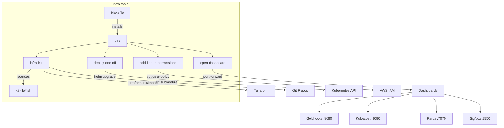

# infra-tools — Architecture

## Overview

A CLI toolkit providing developer-facing commands for Kubernetes cluster setup, ordered Helm deployments, monitoring dashboard access, and AWS IAM policy management. Scripts are installed to `~/.local/bin` via `make install` and share a common shell library (`k8-lib/`) for logging, color output, and configuration helpers.

## System Diagram

## Core Components

| Component | Purpose |
|-----------|---------|
| `bin/infra-init` | Developer setup: Terraform provider init, git submodule hydration, Terraformer batch import, state migration, and `doctor` health check |
| `bin/deploy-one-off` | Template for ordered Helm deployment sequences (infra → stateful → stateless → verify) |
| `bin/open-dashboard` | Port-forwards to cluster monitoring dashboards (Goldilocks, Kubecost, Parca, SigNoz) |
| `bin/add-import-permissions` | Applies the canonical Terraformer IAM policy JSON to the `terraformer-import` AWS user |
| `Makefile` | Installs all scripts to `INSTALL_DIR` (default `~/.local/bin`) |

## Script Details

→ *See [arch/scripts.md](arch/scripts.md) for per-script command reference and configuration*

## Key Decisions

- **Flat `bin/` layout**: All scripts are standalone executables with no inter-script dependencies — keeps installation and PATH management simple
- **Shared library via `k8-lib/`**: `infra-init` sources `../k8-lib/*.sh` for common helpers; other scripts are self-contained
- **Template pattern for deploy-one-off**: Deployment order is documented as commented-out steps rather than a dynamic engine — clarity over automation for one-off recovery scenarios
- **Environment-driven configuration**: Dashboard namespaces, service names, and AWS profiles are overridable via `K8_*` environment variables with sensible defaults
