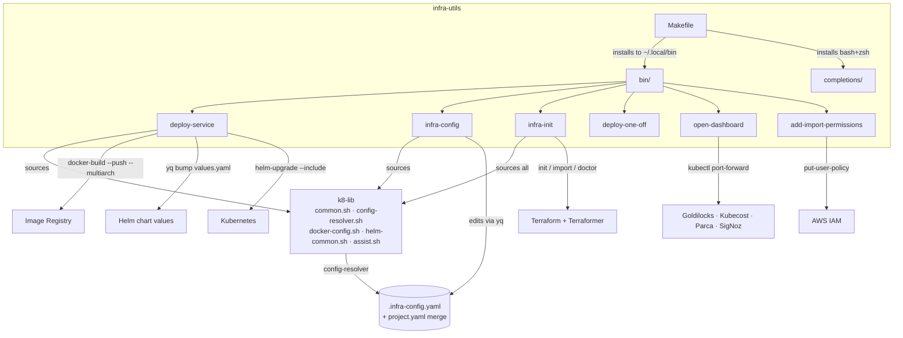

# infra-utils — Architecture

## Overview

`infra-utils` is a terminal utility package: six standalone bash CLIs for infrastructure
bootstrap, `.infra-config.yaml` management, monitoring dashboard access, AWS IAM policy
sync, and the `deploy-service` release pipeline (build → multi-arch push → values.yaml
tag bump → helm upgrade). Scripts install flat to `~/.local/bin` via `make install`
(part of the repo-wide `make install-utilities`) and source shared helpers from k8-lib
(`~/.local/share/k8-lib/bin/*.sh`, overridable via `K8_LIB_DIR`).

Configuration follows the monorepo convention: the repo-root `.infra-config.yaml` is the
single source of truth, resolved by k8-lib's config-resolver (`--config` flag → `K8_CONFIG`
→ `INFRA_ROOT` → git-root walk) and merged with per-project `project.yaml` files. Scalar
AWS/account values come from `.envrc.k8.dc` / `K8_*` environment variables.

→ *Config shapes, flag grammar, env vars, and the push-state ledger are documented in
[PROJ-SCHEMA.md](PROJ-SCHEMA.md) (no DB — the project's "schema" is its config artifacts)*

## System Diagram

```mermaid
graph TB
    subgraph "infra-utils"
        M[Makefile] -->|installs to ~/.local/bin| BIN[bin/]
        M -->|installs bash+zsh| COMP[completions/]
        BIN --> DS[deploy-service]
        BIN --> IC[infra-config]
        BIN --> II[infra-init]
        BIN --> DO[deploy-one-off]
        BIN --> OD[open-dashboard]
        BIN --> AP[add-import-permissions]
    end

    LIB[k8-lib<br/>common.sh · config-resolver.sh<br/>docker-config.sh · helm-common.sh · assist.sh]
    DS -->|sources| LIB
    IC -->|sources| LIB
    II -->|sources all| LIB

    CFG[(.infra-config.yaml<br/>+ project.yaml merge)]
    LIB -->|config-resolver| CFG
    IC -->|edits via yq| CFG

    DS -->|docker-build --push --multiarch| REG[Image Registry]
    DS -->|yq bump values.yaml| CHART[Helm chart values]
    DS -->|helm-upgrade --include| K8[Kubernetes]
    II -->|init / import / doctor| TF[Terraform + Terraformer]
    OD -->|kubectl port-forward| DASH[Goldilocks · Kubecost · Parca · SigNoz]
    AP -->|put-user-policy| AWS[AWS IAM]
```

## Core Components

| Component | Purpose |
|-----------|---------|
| `bin/deploy-service` | Headless release pipeline: resolve image key → `helm:` stanza, build + multi-arch push with edge-tag version promotion, bump chart `values.yaml`, run one `helm-upgrade` per unique release (batched keys fail-fast) |
| `bin/infra-config` | CRUD for `.infra-config.yaml` resources: helm scan dirs, chart-path/namespace/timeout overrides, tier charts, standalone docker images, composite projects + services (`--dry-run`, `--yes`) |
| `bin/infra-init` | Developer setup & health: Terraform init, git submodule hydration, Terraformer batch import/cleanup/state-upgrade, `doctor` — thin dispatcher; all `cmd_*` logic lives in k8-lib |
| `bin/deploy-one-off` | Template (not runnable as-is) documenting canonical ordered Helm recovery/bootstrap sequence (infra → stateful → apps → verify) |
| `bin/open-dashboard` | `kubectl port-forward` + browser-open for monitoring dashboards; `K8_{TOOL}_NS` / `K8_{TOOL}_SVC` overrides |
| `bin/add-import-permissions` | Applies canonical Terraformer IAM policy JSON to the `terraformer-import` AWS user (`--dry-run`, profile fallback chain) |
| `Makefile` | `make install` copies the six scripts to `INSTALL_DIR` (default `~/.local/bin`) and installs bash/zsh completions for `deploy-service` + `infra-config` |
| `completions/` | bash-completion + zsh completion scripts shipped alongside the CLIs |

## deploy-service Pipeline

Each image key (flat `name` or composite `domain/service`) is resolved against the merged
config's `helm:` stanza (`chart_path`, `values_path`, `format: tag|image`). The edge build
tag is derived from the tag currently in `values.yaml` (`v<M>.<m>.edge[-env]`); after
`docker-build --push --multiarch`, the promoted tag is read back from k8-lib's
`.docker-state/pushes` ledger and written into `values.yaml` via `yq`. Releases are
deduplicated so a coupled backend+frontend ship as a single `helm-upgrade`.

→ *See [arch/scripts.md](arch/scripts.md) for per-script command reference and configuration*

## Ecosystem Fit

This package supplies the deploy-orchestration layer over sibling utilities: it shells out
to `docker-build` / `docker-push` / `helm-upgrade` (installed from other `utilities/`
packages) rather than reimplementing them. Helm charts themselves live in the upstream
`noizu-infra` repo or under `projects/*/helm/`; `deploy-service` warns when a chart is not
discoverable by `helm-upgrade` (`paths.helm_dir` / `helm_scan_dirs` / `chart_path_overrides`).

## Key Decisions

- **Flat `bin/`, no inter-script deps**: each script is independently installable and
  callable; composition happens by shelling out to sibling CLIs on PATH
- **k8-lib as the real engine**: `infra-init` is a pure dispatcher into k8-lib `cmd_*`
  functions; `deploy-service`/`infra-config` source only the k8-lib modules they need
- **Config over flags**: deploy wiring lives declaratively in `.infra-config.yaml`
  `helm:` stanzas, managed by `infra-config` — commands take only an image key
- **Version promotion via edge tags**: builds target `v<M>.<m>.edge`; the pushed/promoted
  tag recorded in `.docker-state` is authoritative for the values bump, keeping chart and
  registry in lockstep
- **Template over engine for recovery**: `deploy-one-off` documents deployment order as
  editable commented steps — clarity over automation for one-off scenarios
- **`--assist` AI help**: scripts hook k8-lib `assist.sh` for AI-assisted usage questions
- **Environment-driven overrides**: `K8_*` variables override namespaces, services,
  profiles, and lib location with sensible defaults

## Documentation Suite

`docs/` follows the four-doc convention: ARCH (this file + `arch/scripts.md` per-script
detail), LAYOUT (`PROJ-LAYOUT.md` + summary), SCHEMA (`PROJ-SCHEMA.md` — config-artifact
reference, no DB), FAQ (`PROJ-FAQ.md` + `faq/*.md` why/when/comparison answers), and
HOWTO (`PROJ-HOWTO.md` + `howto/*.md` task guides). Summaries (`*.summary.md`) accompany
each for quick agent/tool reference.
