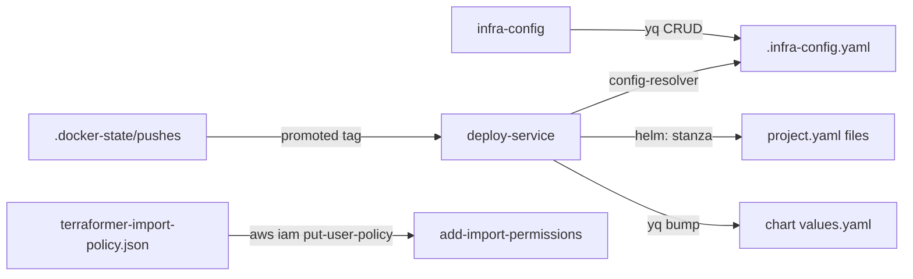

# infra-utils — Schema

> **No persistence layer.** This package has **no database, no SQL schema, and no
> Liquibase changelogs** — it is a set of standalone bash CLIs. There are no tables,
> columns, or ERDs to document. The "schema" of this project is the set of
> **config artifacts it reads and writes**, documented below:
>
> 1. `.infra-config.yaml` — the shared config file `infra-config` edits (lives at the infra root, not in this repo)
> 2. per-project `project.yaml` files — deploy wiring read by `deploy-service`
> 3. CLI flag grammar for each tool
> 4. environment-variable surfaces (config + secrets are referenced, never stored)
> 5. the k8-lib `.docker-state/pushes` ledger `deploy-service` consumes

## 1. `.infra-config.yaml` (shared config)

Managed via `infra-config add|remove|list <resource>`; resolved by k8-lib's
config-resolver (`--config` → `K8_CONFIG` → `INFRA_ROOT` → git-root walk). Lives at the
infra repository root.

| Top-level key | Shape | Purpose | Managed by |
|---------------|-------|---------|------------|
| `helm_scan_dirs[]` | list of path strings | Dirs `helm-upgrade` scans for charts | `helm-dir` |
| `chart_path_overrides` | map chart-name → path | Chart path aliases | `helm-alias` |
| `namespace_overrides` | map chart → namespace | Per-chart namespace overrides | `namespace` |
| `timeout_overrides` | map chart → duration (`10m`/`300s`/`1h`) | Per-chart upgrade timeouts | `timeout` |
| `tiers[]` | list of `{tier: int, name: string, charts[]: string}` | Ordered deploy tiers (tier 0 first) | `tier-chart` |
| `project.docker.images[]` | list of image objects | Standalone Docker build targets | `docker-image`, `docker-dir` |
| `project.projects[]` | list of project objects | Composite projects by domain | `project`, `docker-group` |
| `project.projects[].services[]` | list of service objects | Services within a composite project | `service`, `docker-group` |

### Standalone image object (`project.docker.images[]`)

| Field | Type | Required | Default | Description |
|-------|------|----------|---------|-------------|
| `name` | string | Yes | — | Image key for `docker-build`/`deploy-service` |
| `context` | string | Yes | — | Build context path (repo-root-relative) |
| `dockerfile` | string | No | `Dockerfile` | Dockerfile path within the context |
| `registry_path` | string | No | = `name` | Registry repo path |
| `single_stage` | bool | No | `false` | Skip multi-arch build |
| `helm` | object | For deploy | — | Deploy wiring — see `helm:` stanza below |

### Composite project object (`project.projects[]`)

| Field | Type | Required | Default | Description |
|-------|------|----------|---------|-------------|
| `domain` | string | Yes | — | Project key (`deploy-service <domain>/<svc>`) |
| `base_path` | string | No | — | Project directory path |
| `services[]` | list | Yes | `[]` | Service objects |

### Service object (`project.projects[].services[]`)

| Field | Type | Required | Default | Description |
|-------|------|----------|---------|-------------|
| `name` | string | Yes | — | Service key under the domain |
| `dockerfile` | string | No | `<name>/Dockerfile` | Dockerfile path |
| `context` | string | No | `<name>` | Build context path |
| `registry_path` | string | No | `<domain>/<name>` | Registry repo path |
| `auto_detect` | bool | No | `false` | Written by `infra-config`; always false for managed entries |
| `helm` | object | For deploy | — | Deploy wiring — see below |

### `helm:` stanza (deploy wiring, on an image or service)

| Field | Type | Required | Values/Default | Description |
|-------|------|----------|----------------|-------------|
| `chart_path` | string | Yes | — | Chart dir (holds `values.yaml`), repo-root-relative. Must equal `PROJECT_DIR/helm.path` or reverse-map fails |
| `values_path` | string | Yes | — | `yq` path inside `values.yaml` (`.image.tag`) |
| `format` | string | No | `tag` \| `image` | `tag` = bare version string; `image` = full ref, only the tag is swapped |

## 2. Per-project `project.yaml`

Lives under `paths.projects_dir/<project>/project.yaml` (infra root–relative). Two shapes;
`deploy-service` reads the `helm:` wiring from whichever shape declares the image key.

### Flat shape (one image → one release)

```yaml
status: active
helm:              # project-level release metadata
  release: easy-peasy
  namespace: testing
  tier: 3
  timeout: 15m
  path: helm/easy-peasy
docker:
  images:
    - name: easy-peasy
      context: app
      dockerfile: Dockerfile
      registry_path: testing/easy-peasy
      helm: {chart_path: ..., values_path: .image.tag, format: tag}
```

### Composite shape (`type: composite`, shared release)

```yaml
type: composite
status: active
helm: {release: codefre-sh, namespace: apps, tier: 3, timeout: 15m, path: helm/codefre-sh}
projects:
  - domain: codefre.sh
    services:
      - name: backend
        helm: {chart_path: ..., values_path: .backend.image.tag, format: tag}
      - name: frontend
        helm: {chart_path: ..., values_path: .frontend.image.tag, format: tag}
```

### Project-level `helm:` fields

| Field | Required | Default | Description |
|-------|----------|---------|-------------|
| `release` | Yes (deploy) | — | Helm release name for `helm-upgrade --include` |
| `namespace` | No | — | Registry metadata |
| `tier` | No | `5` | Deploy-ordering metadata |
| `timeout` | No | `10m` | Registry metadata |
| `path` | Yes (reverse-map) | — | Chart path relative to the project dir |

## 3. CLI flag grammar

All scripts accept `--config PATH` / `--config=PATH` (exported as `K8_CONFIG` before
k8-lib resolution) and hook `--assist "<question>"` (k8-lib assist.sh; short-circuits).

### deploy-service

```
deploy-service <image-key> [<image-key>...] [flags]
  <key>            flat name (bottlecrm) or composite (codefre.sh/backend); repeatable
  --tag TAG        force version (vM.m.edge series or literal vX.Y.Z first-release);
                   single image-key only
  --stage|--prod|--dev|  set BUILD_ENV (default dev)
  --env ENV
  --no-cache       pass through to docker-build
  --skip-build     no build/push/bump; deploy current values.yaml
  --skip-deploy    build+push+bump only
  --yes, -y        auto-confirm (DOCKER_YES + AUTO_YES; headless helm-upgrade)
  --dry-run        print the plan; touch nothing
  -v, --verbose    echo sub-commands
  -h, --help
```

### infra-config

```
infra-config <list|add|remove> <resource> [args...] [flags]
  resources: helm-dir | helm-alias | namespace | timeout | tier-chart |
             docker-image | docker-dir | project | service | docker-group
  --config PATH    config file (pre-parsed before k8-lib sourcing)
  --dry-run        diff preview, no write
  --yes, -y        skip confirmation
  bare `list`      lists every resource
```

Arg grammar per resource (examples): `add helm-dir <path>`; `add helm-alias <chart> <path>`;
`add namespace <chart> <ns>`; `add timeout <chart> <duration: ^[0-9]+[msh]$>`;
`add tier-chart <chart> --tier <N>`; `add docker-image <name> --context C [--dockerfile F]
[--registry-path P] [--single-stage]`; `add docker-dir <path> [--name N]`;
`add project <domain> [--base-path P]`; `add service <domain> <name> --dockerfile F
--context C [--registry-path P]`; `add docker-group <base-path> <svc...> [--domain D]`.

### infra-init

```
infra-init <terraform|repos|all|import|cleanup|state-upgrade|doctor>
  import [--force]    re-import all groups even if already imported
```

### add-import-permissions

```
add-import-permissions [--profile PROFILE] [--dry-run]
  PROFILE default chain: --profile → $PROFILE → $K8_AWS_PROFILE → "terraformer"
```

### open-dashboard

```
open-dashboard <goldilocks|kubecost|parca|signoz>
  ports: 8080 | 9090 | 7070 | 3301
```

## 4. Environment-variable surface

No secrets are stored in this repo; all secret/config values are referenced via env
(populated by direnv-config `.envrc.k8.dc` at the infra root).

| Variable | Used by | Purpose | Default |
|----------|---------|---------|---------|
| `K8_LIB_DIR` | all | k8-lib location | `~/.local/share/k8-lib` |
| `INFRA_ROOT` | all | Infra repo root | cwd |
| `K8_CONFIG` | all | `.infra-config.yaml` path (set by `--config`) | resolver walk |
| `BUILD_ENV` | deploy-service | Build/deploy environment | `dev` |
| `DOCKER_YES` / `AUTO_YES` | deploy-service | Headless confirmation (set by `--yes`) | unset |
| `K8_AWS_ACCOUNT_ID` / `K8_AWS_PROFILE` / `K8_AWS_REGION` | infra-init, add-import-permissions | AWS scalar config | profile: `terraformer` |
| `K8_TF_IMPORT_USER` | add-import-permissions | IAM user for import policy | `terraformer-import` |
| `K8_TF_IMPORT_POLICY_NAME` | add-import-permissions | Inline policy name | `TerraformerImportPolicy` |
| `K8_GOLDILOCKS_NS`/`_SVC`, `K8_KUBECOST_NS`/`_SVC`, `K8_PARCA_NS`/`_SVC`, `K8_SIGNOZ_NS`/`_SVC` | open-dashboard | Dashboard namespace/service overrides | see script |
| `K8_NAMESPACE` | deploy-one-off | Target namespace | `default` |
| `K8_NODE_LABEL`, `K8_PLACEMENT_EXCLUDE_PATTERN` | deploy-one-off | Placement-verification filters | `node-group=eks-managed`, k8s system pods |

Secret values (AWS keys, registry creds) are never read directly by these scripts —
they are consumed transitively by `aws`, `docker`, and `helm` from the caller's
environment; the only secret-adjacent artifact is the canonical IAM policy JSON read
from `terraform/production/imported/iam/terraformer-import-policy.json` (lives at the
infra root, not in this repo).

## 5. State files

| File | Producer | Consumer | Format |
|------|----------|----------|--------|
| `<DOCKER_STATE_DIR>/.docker-state/pushes` | k8-lib `docker-push` | `deploy-service` (`last_pushed_vsn`) | pipe-delimited records: `epoch\|image-key\|sha\|version-tag` |

`deploy-service` reads the last recorded `version-tag` per image key to learn the
promoted tag after an edge build; `--tag vX.Y.Z` bypasses the ledger (verbatim write).

## Artifact relationships



```plantuml
@startuml
skinparam linetype ortho

entity ".infra-config.yaml" as CFG {
  * helm_scan_dirs[] : path
  * chart_path_overrides : map
  * namespace_overrides : map
  * timeout_overrides : map
  * tiers[] : {tier, name, charts[]}
  * project.docker.images[] : image
  * project.projects[].services[] : service
}
entity "project.yaml (flat|composite)" as PY {
  * helm.release, tier, timeout, path
  * docker.images[] / projects[].services[]
  * helm: {chart_path, values_path, format}
}
entity ".docker-state/pushes" as LEDGER {
  * epoch|image-key|sha|version-tag
}
entity "chart values.yaml" as VALUES {
  * <values_path> : tag | image
}

CFG ||--o{ PY : "projects_dir scan"
DS[deploy-service] --> PY : resolves helm stanza
LEDGER --> DS : promoted tag
DS --> VALUES : yq bump
IC[infra-config] --> CFG : yq CRUD
@enduml
```
