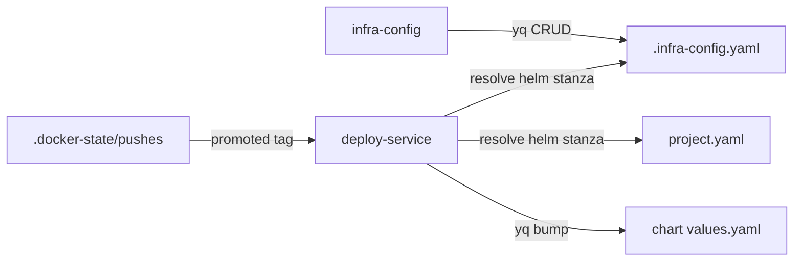

# Schema — Summary

**No persistence layer** — no database, no SQL schema, no Liquibase changelogs. This
package's "schema" is its config artifacts: `.infra-config.yaml` (shared, edited by
`infra-config`), per-project `project.yaml` files (deploy wiring), CLI flag grammar,
env-var surface, and the k8-lib `.docker-state/pushes` ledger.

→ Full field tables, flag grammar, and env-var reference: [PROJ-SCHEMA.md](PROJ-SCHEMA.md)

## Artifacts at a glance

| Artifact | Owner | Read by | Key shapes |
|----------|-------|---------|------------|
| `.infra-config.yaml` | infra root (not this repo) | all scripts (k8-lib config-resolver) | `helm_scan_dirs[]`, `chart_path_overrides`, `namespace_overrides`, `timeout_overrides`, `tiers[].charts[]`, `project.docker.images[]`, `project.projects[].services[]` |
| `project.yaml` (flat) | `paths.projects_dir/<proj>/` | deploy-service | `helm.{release,tier,timeout,path}`, `docker.images[].helm.{chart_path,values_path,format}` |
| `project.yaml` (composite) | same | deploy-service | `type: composite`, `projects[].services[].helm` — shared release, one deduped upgrade |
| `.docker-state/pushes` | k8-lib docker-push | deploy-service | `epoch\|image-key\|sha\|version-tag` per line |
| IAM policy JSON | infra root `terraform/production/imported/iam/` | add-import-permissions | canonical Terraformer inline policy |
| Env vars (`K8_*`, `BUILD_ENV`, …) | caller / `.envrc.k8.dc` | all scripts | config + secret references; no secrets stored here |

## helm: stanza (deploy wiring)

`chart_path` (required, must equal `PROJECT_DIR/helm.path`) · `values_path` (required,
yq path) · `format` (`tag` default | `image`).

## CLI surface

- `deploy-service <key>... [--tag T] [--stage|--prod|--env E] [--skip-build|--skip-deploy] [--no-cache] [--yes] [--dry-run]`
- `infra-config <list|add|remove> <helm-dir|helm-alias|namespace|timeout|tier-chart|docker-image|docker-dir|project|service|docker-group> [--config P] [--dry-run] [-y]`
- `infra-init <terraform|repos|all|import|cleanup|state-upgrade|doctor>`
- `add-import-permissions [--profile P] [--dry-run]`
- `open-dashboard <goldilocks|kubecost|parca|signoz>`

## Relationships

